# 1.排序

##  认识复杂度

算法流程按照最差情况来估计时间复杂度。

### 选择排序

时间复杂度：$O（n^2)$

额外空间复杂度：$O（1）$
```java
public static void seleceionSort(int[] arr){
    //数组不合规
    if(arr==null||arr.length<2){
        return;
    }
    //下标从小到大进行遍历，当前值与后面的值进行比较，如果后面的值更小，则交换。
    for(int i=0;i<arr.length-1;i++){
        int minIndex=i;
        for(int j=1;j<arr.length;j++){
            minIndex=arr[j]<arr[minIndex]?j:minIndex;
        }
        swap[arr,i,minIndex];
    }
}
public static void swap(int[] arr,int i,int j){
    int tmp=i;
    arr[i]=arr[j];
    arr[j]=arr[tmp];
}


```
### 冒泡排序
时间复杂度：$O（n^2)$

额外空间复杂度：$O（1）$


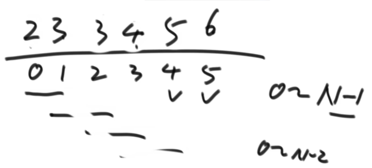
```java
public static void bubbleSort(int[] arr){
    if(arr==null||arr.length<2){
        return;
    }
    //e是大循环
    for(int e=arr.length-1;e>0;e--){

        for(int i=0;i<e;i++){
            if(arr[i]>arr[i+1]){
                swap(arr,i,i+1);    
            }
        }
    }
}
//交换arr上i和j的位置
public static void swap(int[] arr,int i,int j){
    arr[i]=arr[i]^arr[j];
    arr[j]=arr[i]^arr[j];
    arr[i]=arr[i]^arr[j];
}

```

对于swap这个代码，我们需要了解异或运算，一个数异或它本身等于0，一个数异或0等于0，即a^a=0;a^0=0;


同时异或运算也满足交换律和结合律，即a^b=b^a;(a^b)^c=a^(b^c);


我们可以证明swap这个代码：

$①arr[i]$=$arr[i]$^$arr[j]$;

$arr[j]$=$arr[i]$^$arr[j]$,将①带入可得$arr[j]$=$arr[i]$^$arr[j]$^$arr[j]$

即$②arr[j]=arr[i]$；

$arr[i]=arr[i]$^$arr[j]$，将①和②带入可得$arr[i]=arr[i]$^$arr[j]$^$arr[i]$

即$arr[i]=arr[j]$；

用简单的例子举例：假设$arr[i]=5 ;arr[j]=8，在计算机中表示为arr[i]=0101;arr[j]=1000$

$arr[i]=arr[i]$^$arr[j]=0101$^$1000=1101;$

$arr[j]=arr[i]$^$arr[j]=1101$^$1000=0101;$

$arr[i]=arr[i]$^$arr[j]=1101$^$0101=1000;$


一个关于异或运算的题目：


在一个整形数组中

①只有一种数出现了奇数次，其他数出现了偶数次，怎么找到奇数次的数？

将每一个数都遍历一遍得到的结果就为解。

```java
public static void printOddTimesNums(int[] arr){
    int eor=0;
    for(int cur:arr){
        eor^=cur;
    }
    System.out.println(eor);
}
```
②有两种数出现了奇数次，其他数出现了偶数次，怎么找到这两个数？

将每个数都遍历一遍得到的结果是这两个数异或，$eor=a$^$b$，因为$a≠b$，所以$eor$肯定有一位为1，我们可以找到最右边第一个1，将每一个数和这个最右边第一个1进行与运算，结果等于1或者0的数依次进行与运算，结果就是$a$或$b$，再与$eor$进行异或操作就是另一个数。
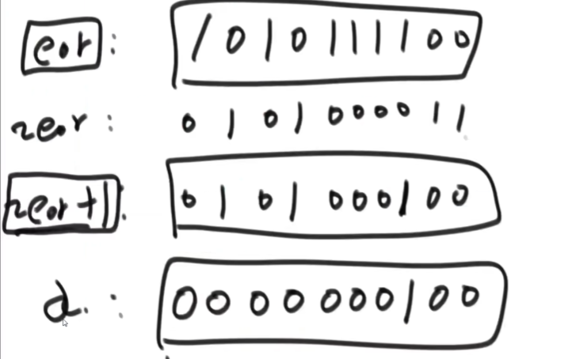

```java
public static void printOddTimesNums(int[] arr){
    int eor=0;
    for(int i=0;i<arr.length;i++){
        eor^=arr[i];
    }
    int onlyOne=0;
    int rightOne=eor&(~eor+1);
    for(int cur:arr){
        if((cur&rightOne)==1){
            onlyOne^=cur;
        }
    }
    System.out.println(onlyOne+" "+(eor^onlyOne));
}

```

### 插入排序


时间复杂度：$O（n^2)$

额外空间复杂度：$O（1）$


从0~0依次到0~n范围内，第n个数往前一个数看判断是否需要交换位置。
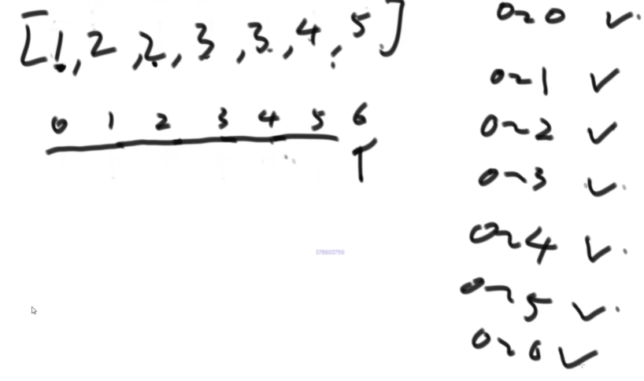

```java
public static void insertionSort(int[] arr){
    if(arr==null||arr.length<2){
        return;
    }
    //0-i做到有序
    for(int i=1;i<arr.length;i++){
        for(int j=i-1;j>=0&&arr[j]>arr[i];j--){
            swap(arr,j,j+1);
        }
    }
}
//i和j是一个位置的话，会出错
public static void swap(int[] arr,int i,int j){
    arr[i]=arr[i]^arr[j];
    arr[j]=arr[i]^arr[j];
    arr[i]=arr[i]^arr[j];
}
```

### 二分法

在一个有序数组找某个数是否存在：先找到中点的数，和目标值比较，如果中点值大于目标值，就从小于中点值的区域二分。如果中点值小于目标值，就从大于中点值的区域二分。

$O（logN)$
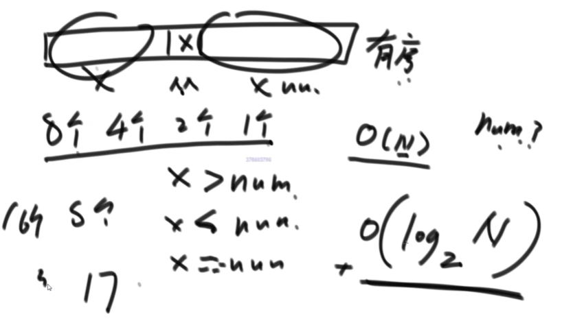

在一个有序数组中，找到第一个>=某个数最左侧的位置：先找到中点的位置，和目标值比较，如果中点值大于目标值，就从小于中点值的区域继续二分。如果中点值小于目标值，就从大于中点值的区域继续二分。直到二分到某个位置后没有值后停。

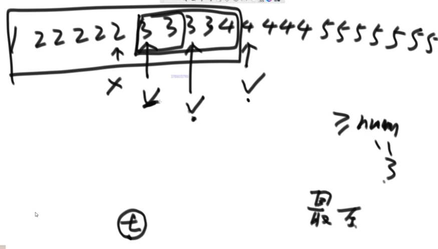


任意两个相邻的数不相等，求局部最小值，要求时间复杂度$O(n)$：取中点位置m,如果m-1位置小于m，则在0~m区间内必有局部最小值，继续二分。


### 对数器


写出一个确定对的简单方法（暴力），然后与想要测的方法进行比较，用随机样本跑两个方法，大量的测试如果全都一样，则可以证明想要测的方法是正确的。
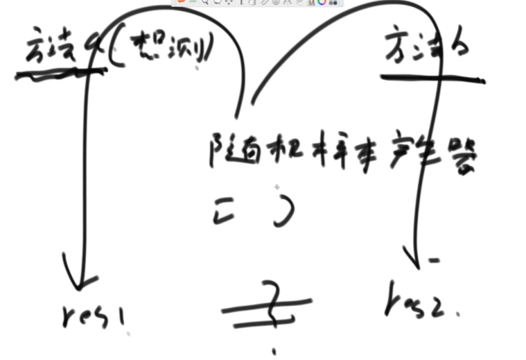


### master公式

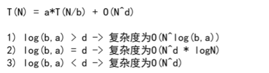

求区域内最大值：
```java
public static int getMax(int[] arr){
    return process(arr,0,arr.length-1);
}

public static int process(int[] arr,int L,int R){
    if(L==R){
        return arr[L];
    }

    int mid=L+((R-L)>>1);//中点
    int leftMax=process(arr,L,mid);
    int rightMax=process(arr,mid+1,R);
    return Math.max(leftMax,rightMax);
}
```
任何递归的问题都可以用master公式求时间复杂度。


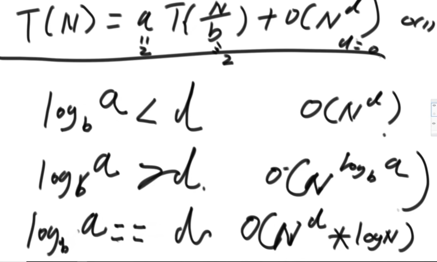


### 归并排序

时间复杂度：$O（nlogn)$

额外空间复杂度：$O（n）$


先把数组分为两个部分，先使得每个部分有序，左侧和右侧各有一个下标，利用辅助空间，谁小拷贝谁，哪侧越界，另一侧直接拷贝。
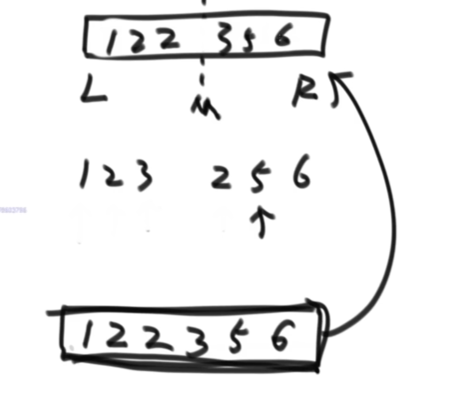

```java
public static void mergeSort(int[] arr){
    if(arr==0||arr.length<2){
        return;
    }
    process(arr,0,arr.length-1);
}
public static void process(int[] arr,int L,int R){
    if(L==R){
        return arr[L];
    }
    int mid=L+((R-L)>>1);
    process(arr,L,mid);
    process(arr,mid+1,R);
    merge(arr,L,mid,R);
}
public static void merge(int[] arr,int L,int M,int R){
    int[] help=new int[R-L+1];
    int i=0;
    int p1=L;
    int p2=M+1;
    while(p1<=M&&p2<=R){
        help[i++]=arr[p1]<=arr[p2]?arr[p1++]:arr[p2++];
    }
    while(p1<=M){
        help[i++]=arr[p1++];
    }
    while(p2<=R){
        help[i++]=arr[p2++];
    }
    for(int i=0;i<help.length;i++){
        arr[L+i]=help[i];
    }
}
```
process是递归，merge的时间复杂度是$O(n)$
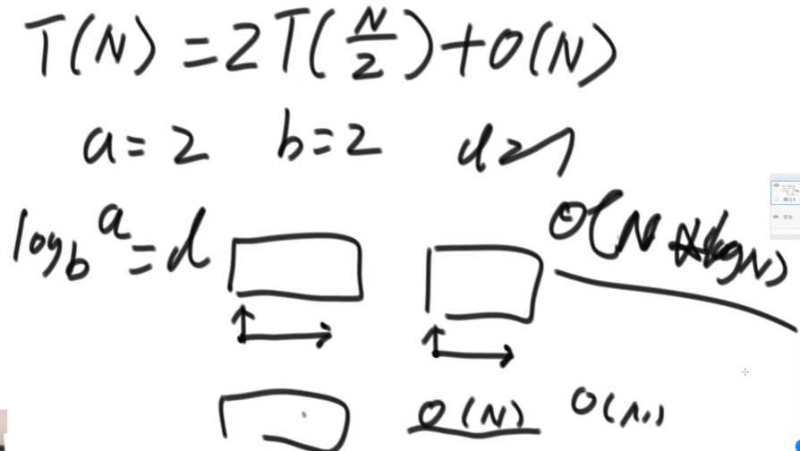


小和问题：把每一个数左边比当前数小的数累加起来，可以等同于把每个数右边比当前数大的数累加起来。
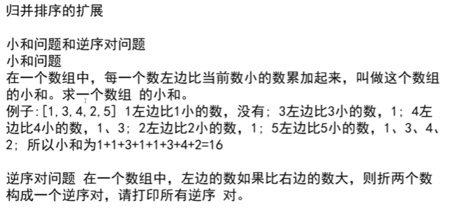

例如[1,3,4,2,5]分为两部分[1,3,4]和[2,5]，一直分到只有一个数，然后开始从左到右merge。
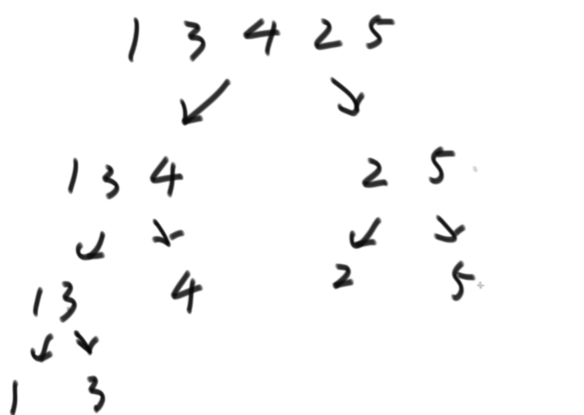

把左边和右边分开之后，用两个下标，左边的每个数和右边的第一个数比，找到第一个比左边的数大的值，然后可以通过下标计算算得右边有多少数更大。算完后放入数组排序。
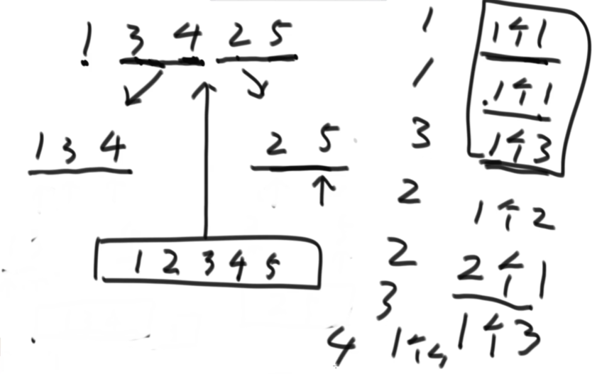

```java
public static int smallSum(int[] arr){
    if(arr==null||arr.length<2){
        return;
    }
    process(arr,0,arr.length);
}

public static int process(int[] arr,int l;,int r){
    if(l==r){
        return 0;
    }
    int mid=l+((r-l)>>1);
    return process(arr,l,mid)+process(arr,mid+1,r)+merge(arr,l,mid,r);
}

public static int merge(int[] arr,int l,int m,int r){
    int[] help=new int[r-l+1];
    int i=0;
    int p1=l;
    int p2=m+1;
    int res=0;
    while(p1<=m&&p2<=r){
        res+=arr[p1]<arr[p2]?arr[p1]*(r-p2+1):0;
        help(i++)=arr[p1]<arr[p2]?arr[p1++]:arr[p2++];
    }
    while(p1<=m){
        help(i++)=arr[p1++];
    }
    while(p2<=r){
        help(i++)=arr[p2++];
    }
    return res;
}
```

### 快速排序

荷兰国旗问题：
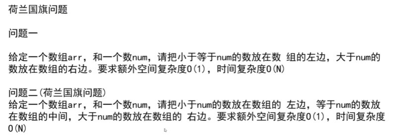

$选定一个目标值num，如果第i个值[i]<num，[i]和小于区下一个位置交换，小于区右扩，i自增；$

$如果[i]=num，i自增$

$如果[i]<num，[i]和大于区前一个位置交换，大于区左扩，i不变$
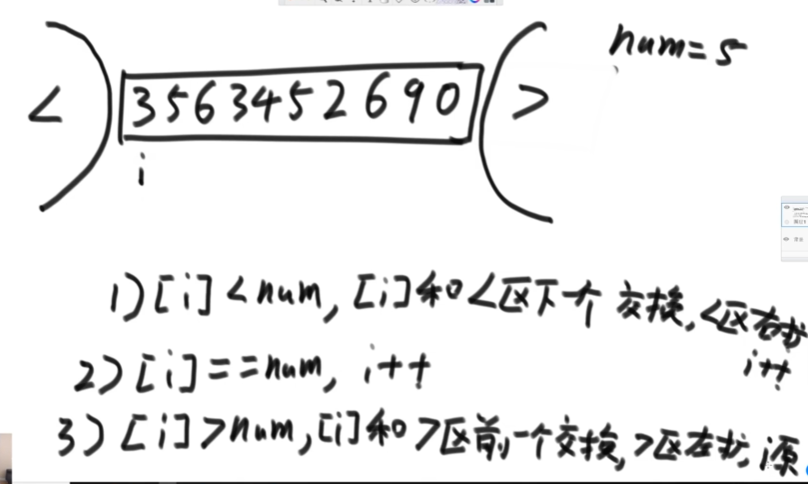


快速排序：随机选一个数和数组最后一个值交换，然后那这个随机数进行划分，此时是一个概率问题。因为每一个情况都是等概率，所以最终算出来时间复杂度为$O（nlogn)$

空间复杂度$O（logn)$


```java
public static void quickSort(int[] arr){
    if(arr==null||arr.length<2){
        return;
    }
    quickSort(arr,0,arr.length-1)
}
public static void quickSort(int[] arr,int L,int R){
    if(L<R){
        swap(arr,L+(int)(Math.random()*(R-L+1)),R);
        int[] p=partition(arr,L,R);
        qucikSort(arr,L,p[0]-1);//小于区
        quickSort(arr,p[1]+1,R);//大于区
    }    
}
public static int[] partition(int[] arr,int L,int R){
    int less=L-1;//小于区右边界
    int more=R;//大于区左边界
    while(L<more){
        if(arr[L]<arr[R]){
            swap(arr,++less,L++)
            }
            else if(arr[L]>arr[R]){
                swap(arr,--more,L);
            }
            else{
                L++;
            }
        }
        swap(arr,more,R);
        return new int[] {less+1,more};
    }
public static void swap(int[] arr,int l,int r){
    arr[l]=arr[l]^arr[r];
    arr[r]=arr[l]^arr[r];
    arr[l]=arr[l]^arr[r];
}
```


### 堆

堆在逻辑结构上是一个完全二叉树

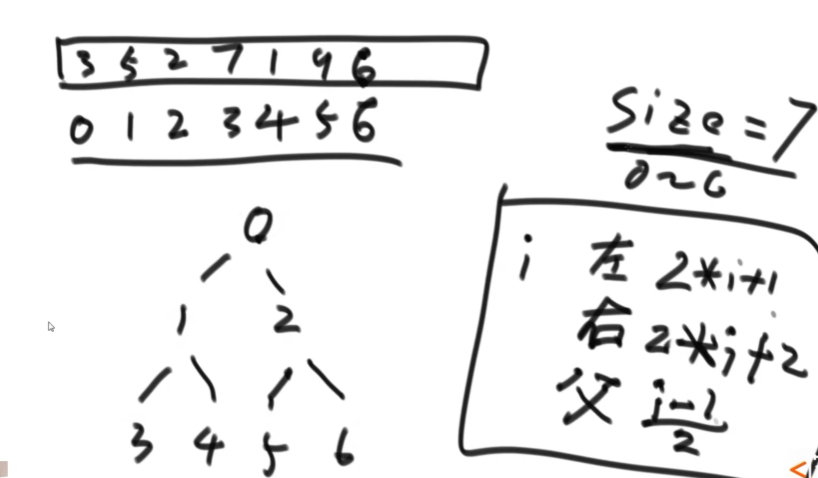

大根堆：在一个完全二叉树中，每一棵子树，它的最大值是头结点的值。
小根堆：在一个完全二叉树中，每一棵子树，它的最小值是头结点的值。


```java
//某个数要往上移动
public static void heapInsert(int[] arr,int index){
    while(arr[index]>arr[(index-1)/2]){
        swap(arr,index,(index-1)/2);
        index=(index-1)/2;
    }
}
```

```java
//某个数在index位置，他是否能往下移动
public static void heapify(int[] arr,int index,int heapSize){
    int left=index*2+1;//左孩子的下标
    //下方还有孩子的时候
    while(left<heapSize){
    //两个孩子之间比较，谁更大，把下标给largest
        int largest=left+1<heapSize&&arr[left+1]>arr[left]?left+1:left;
        //父节点和较大的子节点比较，更大的把下标给largest
        largest=arr[largest]>arr[index]?largest:index;
        if(largest==index){
            break;
        }
        swap(arr,largest,index);
        index=largest;
        left=index*2+1;
    }
}
```
堆排序：时间复杂度$O（nlogn)$

空间复杂度$O(1)$
```java
public static void heapSort(int[] arr){
    if(arr==null||arr.length<2){
        return;
    }
    //变成大根堆
    // for(int i=0;i<arr.length-1,i++){
    //     heapInsert(arr,i);//O(logn)
    // }
    for(int i=arr.length-1,i>=0,i--){
        heapify(arr,i,arr.length);//O(n)
    }
    int heapSize=arr.length;
    swap(arr,0,--heapSize);
    while(heapSize>0){
        heapify(arr,0,heapSize);
        swap(arr,0,--heapSize);
    }
}

public static void heapInsert(int[] arr,int index){
    while(arr[index]>arr[(index-1)/2]){
        swap(arr,index,(index-1)/2);
        index=(index-1)/2;
    }
}

public static void heapify(int[] arr,int index,int heapSize){
    int left=index*2+1;//左孩子的下标
    //下方还有孩子的时候
    while(left<heapSize){
    //两个孩子之间比较，谁更大，把下标给largest
        int largest=left+1<heapSize&&arr[left+1]>arr[left]?left+1:left;
        //父节点和较大的子节点比较，更大的把下标给largest
        largest=arr[largest]>arr[index]?largest:index;
        if(largest==index){
            break;
        }
        swap(arr,largest,index);
        index=largest;
        left=index*2+1;
    }
}

public static void swap(arr,int i,int j){
    int tmp=arr[i];
    arr[i]=arr[j];
    arr[j]=tmp;
}
```

优先级队列即小根堆

```java
 PriorityQueue<Integer> heap=new PriorityQueue<>();
 ```

 ### 桶排序

利用词频表，表示小于等于某个数有多少个。
 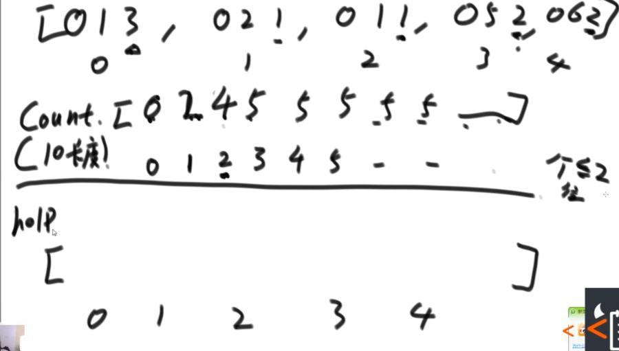
创建一个辅助数组，从右往左进组，例如062个位是2，有4个个位数字小于等于2的值，062放在下标为3的位置，并且词频表个位数字小于等于2的值减一。
 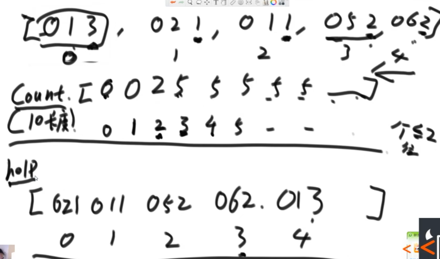

 ```java
 
public static void radixSort(int[] arr,int L,int R,int digit){
    final int radix=10;
    int i=0; 
    int j=0;
    int[] bucket=new int[R-L+1];//有多少个数准备多少个辅助空间
    for(int d=1;d<=digit;d++){//有多少位就进出多少位
    // 10个空间
    // count[0]当前位（d位）是0的数字有多少个
    // count[1]当前位（d位）是（0和1）的数字有多少个
    // count[2]当前位（d位）是（0.1和2）的数字有多少个
    // count[i]当前位（d位）是（0~i）的数字有多少个
        int[] count=new int[radix];
        for(i=L;i<=R;i++){
            j=getDigit(arr[i],d);
            count[j]++;
        }
        for(i=1;i<radix;i++){
            count[i]=count[i]+count[i-1];
        }
        for(i=R;i>=L;i--){
            j=getDigit(arr[i],d);
            bucket[count[j]-1]=arr[i];
            count[j]--;
        }
        for(i=L,j=0;i<=R;i++,j++){
            arr[i]=bucket[j];
        }
    }
}

public static int getDigit(int x,int d){
    return((x/((int)Math.pow(10,d-1)))%10);
}
 ```


### 稳定性

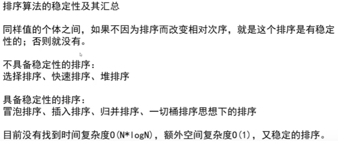


 ### 总结

|排序名称| 时间复杂度 |空间复杂度|稳定性| 
| ----- | ----- | ----- | ----- |
| 选择排序| $O(N^2)$ | $O(1)$ | 不稳定 |
| 冒泡排序| $O(N^2)$ | $O(1)$ | 稳定 |
| 插入排序| $O(N^2)$ | $O(1)$ | 稳定 |
| 归并排序| $O(N*logN)$ | $O(N)$ | 稳定 |
| 快速排序| $O(N*logN)$ | $O(logN)$ | 不稳定 |
| 堆排序| $O(N*logN)$ | $O(1)$ | 不稳定 |

